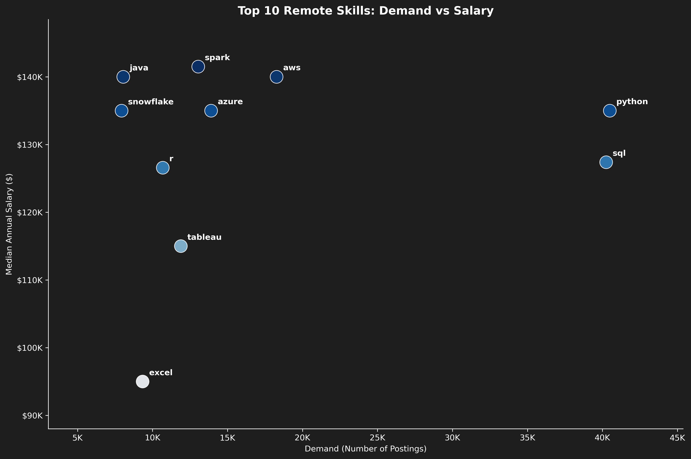
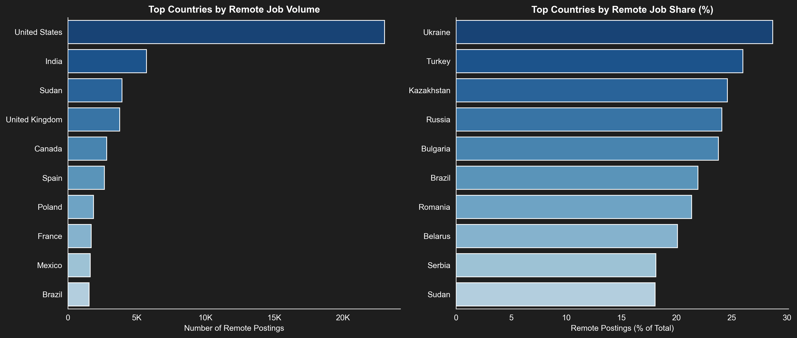
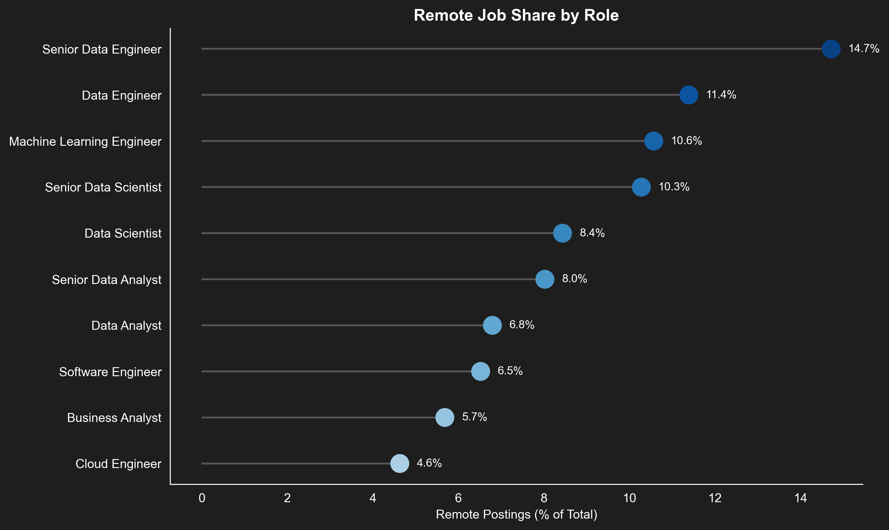
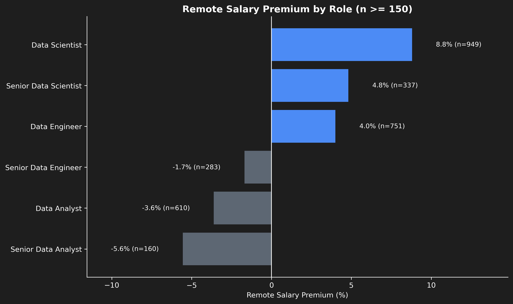
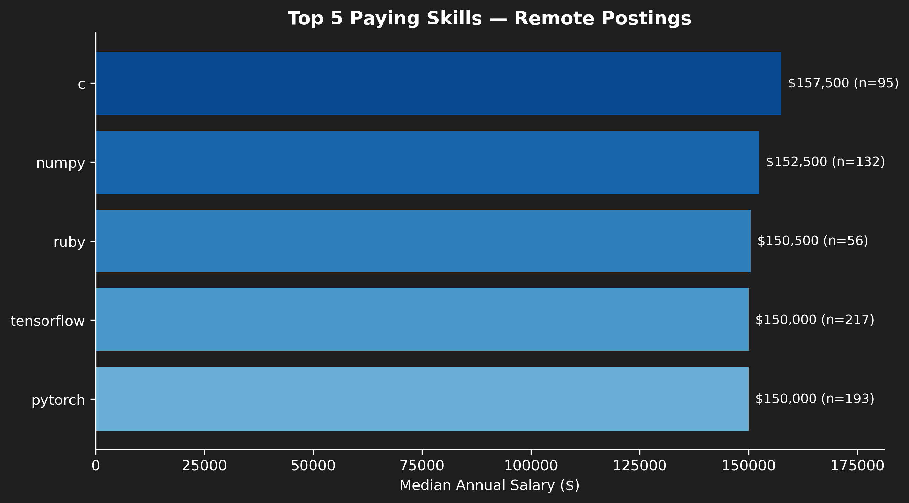
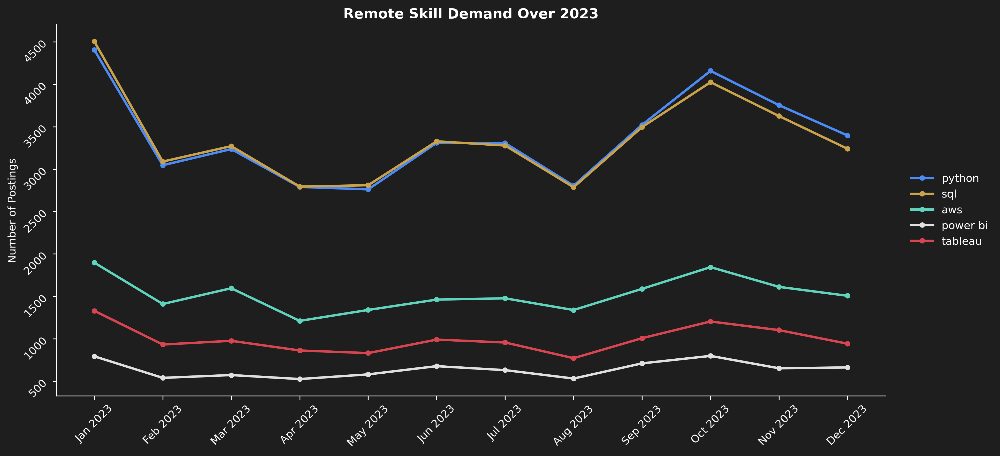

# Remote Data Careers Pipeline


## Key Findings

- Remote postings make up **8.85%** of the dataset. Countries with smaller job markets (Ukraine, Turkey, Kazakhstan) show a proportionally higher remote share than the US.
- The remote salary premium (**+12%** globally) is uneven: Data Analyst roles see little to no premium once low-sample roles are filtered out, while Data Engineer and Data Scientist roles see a modest positive one.
- **Python** is the clearest sweet spot skill: highest demand, paired with a strong median salary. Cloud and ML tools (Kubernetes, PyTorch, TensorFlow) pay the most overall.
- Demand for core skills (Python, SQL, AWS) stayed stable throughout 2023, with no major shifts across the year.
- Excluding US postings barely changes these patterns, and the remote salary premium is even stronger outside the US (**+20.4%**), suggesting these findings hold beyond the dataset's US-heavy origin.

---

## Table of Contents

1. [Introduction](#introduction)
2. [Setup](#setup)
3. [Data Preparation & Cleanup](#data-preparation--cleanup)
4. [Remote Job Landscape](#remote-job-landscape)
5. [Remote Salary Premium](#remote-salary-premium)
6. [Top Skills for Remote Roles](#top-skills-for-remote-roles)
7. [Beyond the US](#beyond-the-us)
8. [Conclusion](#conclusion)
9. [Tools Used](#tools-used)
10. [What I Learned](#what-i-learned)

---

## Introduction

I built this project using a 2023 dataset of data job postings collected by Luke Barousse. The data skews heavily toward the US, but I wanted to see what it could still tell us about remote work, where skills tend to matter more than geography, and where a US-centric dataset can still be genuinely useful to someone job-hunting anywhere else.

Instead of jumping straight into analysis, I first spent time cleaning and structuring the raw dataset myself: handling missing values, parsing nested fields, standardizing formats. It's a step that doesn't show up in most portfolio projects, but it's usually where the real work happens, and where I wanted to practice fundamentals I'm building as I move between data analysis and data engineering.

From there, I focused the analysis around a few concrete questions:

1. **Data Cleaning & Structuring**: How can raw job posting data be transformed into a clean, analysis-ready dataset?
2. **Remote Landscape**: Which countries and roles offer the most remote data job opportunities?
3. **Remote Salary Premium**: Does remote work pay more or less than on-site roles, and does this vary by skill or role?
4. **Top Skills for Remote Roles**: Which skills are most in-demand and best-paid specifically for remote positions?
5. **Beyond the US**: What does the data job market look like when we exclude US-based postings?

I chose to center this project on remote work specifically because it's the one angle where a US-heavy dataset still translates directly into something I can use: if a skill or role consistently shows up as valuable for remote positions, that's a signal worth acting on regardless of where I'm located. Rather than treating the US bias as a limitation to work around, I wanted to make it part of the story.

Data source: [Luke Barousse's Data Nerd Skills dataset](https://huggingface.co/datasets/lukebarousse/data_jobs)
Full code and notebooks: [lien vers ton repo]

---

## Setup

To reproduce this project locally:

```bash
git clone [lien vers ton repo]
cd PYTHON_DATA_PROJECT
conda env create -f environment.yml
conda activate python_data_project
```

Then open any notebook in the `notebooks/` folder using VS Code or Jupyter.


---

## Data Preparation & Cleanup

Before diving into analysis, I spent time cleaning and structuring the raw dataset, a step that's easy to skip in portfolio projects, but where most of the real work actually happens.

### Parsing nested columns

`job_skills` and `job_type_skills` were stored as string representations of Python objects (a list and a dictionary, respectively) rather than usable data types.

```python
def parse_skills(x):
    if isinstance(x, str):
        return ast.literal_eval(x)
    return x

df['job_skills'] = df['job_skills'].apply(parse_skills)
df['job_type_skills'] = df['job_type_skills'].apply(parse_skills)
```

### Fixing data types

`job_posted_date` was stored as a plain string and converted to a proper `datetime` type, enabling time-based analysis later on.

```python
df['job_posted_date'] = pd.to_datetime(df['job_posted_date'])
```

### Handling missing values, without losing data

Rather than dropping every row with a missing value, I checked each affected column individually to see whether the missing data was randomly distributed or concentrated in specific segments.

```python
cols_to_check = ['job_title', 'job_location', 'job_via', 'job_schedule_type', 'job_country', 'company_name']

for col in cols_to_check:
    print(f"--- Missing values in '{col}' ---")
    print(f"Total missing: {df[col].isnull().sum()} ({df[col].isnull().mean()*100:.2f}%)")
    null_dist = df[df[col].isnull()]['job_country'].value_counts(normalize=True).head(5)
    overall_dist = df['job_country'].value_counts(normalize=True).head(5)
    print("\nTop countries among missing rows:")
    print(null_dist)
    print("\nTop countries overall (for comparison):")
    print(overall_dist)
```
| Column | Missing (%) | Top country among missing rows | Bias detected? |
|---|---|---|---|
| job_location | 0.13% | United States (75.4%) | Yes, minor |
| job_schedule_type | 1.61% | Philippines (35.0%) | Yes, minor |
| job_country | 0.01% | N/A | No |

**Findings**:
- `job_location` (0.13% missing) and `job_country` (0.01% missing): negligible volume, left as-is.
- `job_schedule_type` (1.6% missing): missing values were concentrated in a few countries, notably the Philippines and Malaysia, rather than randomly spread. Given the low overall volume, these rows were kept and filled instead of dropped:

```python
df['job_schedule_type'] = df['job_schedule_type'].fillna('Not Specified')
```

- `job_skills` / `job_type_skills`: left untouched at this stage; missing values are filtered out only within the specific analyses that require skill data.

### Isolating salary data

Only about 4% of postings include salary information. Rather than dropping the other 96% or dragging incomplete columns through every analysis, these rows were isolated into a dedicated subset.

```python
df_salary = df[df['salary_year_avg'].notna() | df['salary_hour_avg'].notna()].copy()
```
| Dataset | Rows | % of total |
|---|---|---|
| Main dataset | 785,741 | 100% |
| Salary dataset | 32,665 | 4.2% |

**Result**: 32.7K rows out of 785.7K (about 4.2%), kept separate so the main dataset stays fully usable for non-salary analyses.

### Validating the remote work flag

Since this project focuses heavily on remote opportunities, I checked whether `job_work_from_home` could be trusted as the single indicator of remote status.

```python
df[df['job_work_from_home'] == True]['job_location'].value_counts().head(10)
```
| job_location | Count |
|---|---|
| Anywhere | 69,552 |

**Finding**: Every row flagged as remote had `job_location == 'Anywhere'`, with no exceptions, confirming `job_work_from_home` as a fully reliable single source of truth for remote status. Remote postings make up **8.85%** of the dataset (69.6K out of 785.7K rows).

### Exporting clean data

```python
df.to_parquet('../data/clean/data_jobs_clean.parquet', index=False)
df_salary.to_parquet('../data/clean/data_jobs_salary.parquet', index=False)
```

The `.parquet` format preserves data types (dates, booleans, parsed lists/dicts) without needing to re-parse them on reload; a small but deliberate choice to mirror a reusable data pipeline rather than a one-off cleaning script.

---

## Remote Job Landscape

**Question**: Which countries and roles offer the most remote data job opportunities?

Remote postings make up **8.85%** of the dataset, a relatively small slice, but one worth digging into carefully, since where the *volume* of remote jobs is highest isn't always where the *share* of remote jobs is highest.

### Remote share by country

```python
country_remote_share = (
    df.groupby('job_country')['job_work_from_home']
    .agg(['sum', 'count'])
    .rename(columns={'sum': 'remote_count', 'count': 'total_postings'})
)
country_remote_share['remote_pct'] = (country_remote_share['remote_count'] / country_remote_share['total_postings']) * 100
country_remote_share = country_remote_share[country_remote_share['total_postings'] >= 500]
top_remote_share = country_remote_share.sort_values('remote_pct', ascending=False).head(10)
```

```python
fig, axes = plt.subplots(1, 2, figsize=(14, 6))
bg_color = '#1e1e1e'
fig.patch.set_facecolor(bg_color)

def get_dark_bg_palette(n):
    full_palette = sns.color_palette('Blues', n_colors=n + 4)
    return full_palette[4:][::-1]

top_volume = top_remote_countries.reset_index()
top_volume.columns = ['job_country', 'remote_count']
palette_volume = get_dark_bg_palette(len(top_volume))
sns.barplot(data=top_volume, y='job_country', x='remote_count', hue='job_country',
            palette=palette_volume, legend=False, ax=axes[0])
axes[0].set_facecolor(bg_color)
axes[0].set_title('Top Countries by Remote Job Volume', fontsize=12, weight='bold', color='white')
axes[0].set_xlabel('Number of Remote Postings', color='white')
axes[0].set_ylabel('')
axes[0].tick_params(colors='white')
axes[0].grid(False)
axes[0].spines[['top', 'right']].set_visible(False)
axes[0].spines[['left', 'bottom']].set_color('white')
axes[0].xaxis.set_major_formatter(FuncFormatter(count_formatter))

top_share = top_remote_share.reset_index()
palette_share = get_dark_bg_palette(len(top_share))
sns.barplot(data=top_share, y='job_country', x='remote_pct', hue='job_country',
            palette=palette_share, legend=False, ax=axes[1])
axes[1].set_facecolor(bg_color)
axes[1].set_title('Top Countries by Remote Job Share (%)', fontsize=12, weight='bold', color='white')
axes[1].set_xlabel('Remote Postings (% of Total)', color='white')
axes[1].set_ylabel('')
axes[1].tick_params(colors='white')
axes[1].grid(False)
axes[1].spines[['top', 'right']].set_visible(False)
axes[1].spines[['left', 'bottom']].set_color('white')

plt.tight_layout()
plt.savefig('../images/remote_volume_vs_share.png', dpi=300, bbox_inches='tight', facecolor=bg_color)
```



The US, India, and the UK post the most remote jobs in absolute numbers, unsurprising, since they also post the most jobs overall. But the share of remote postings *within* each country tells a different story: Ukraine (28.7%), Turkey (26.0%), and Kazakhstan (24.6%) show a much higher proportion of remote work relative to their total job volume, despite having far smaller overall markets than the US.

### Remote share by role

```python
role_remote_share = (
    df.groupby('job_title_short')['job_work_from_home']
    .agg(['sum', 'count'])
    .rename(columns={'sum': 'remote_count', 'count': 'total_postings'})
)
role_remote_share['remote_pct'] = (role_remote_share['remote_count'] / role_remote_share['total_postings']) * 100
top_role_share = role_remote_share.sort_values('remote_pct', ascending=False)
```

```python
fig, ax = plt.subplots(figsize=(10, 6))
bg_color = '#1e1e1e'
fig.patch.set_facecolor(bg_color)
ax.set_facecolor(bg_color)

data = top_role_share.reset_index().sort_values('remote_pct', ascending=True)
colors = sns.color_palette('Blues', n_colors=len(data) + 4)[4:]

ax.hlines(y=data['job_title_short'], xmin=0, xmax=data['remote_pct'], color='#555555', linewidth=1.5)
ax.scatter(data['remote_pct'], data['job_title_short'], color=colors, s=200, zorder=3)

for i, (val, role) in enumerate(zip(data['remote_pct'], data['job_title_short'])):
    ax.text(val + 0.4, i, f'{val:.1f}%', va='center', color='white', fontsize=9)

ax.set_title('Remote Job Share by Role', fontsize=13, weight='bold', color='white')
ax.set_xlabel('Remote Postings (% of Total)', color='white')
ax.set_ylabel('')
ax.tick_params(colors='white')
ax.grid(False)
ax.spines[['top', 'right']].set_visible(False)
ax.spines[['left', 'bottom']].set_color('white')

plt.tight_layout()
plt.savefig('../images/remote_share_by_role.png', dpi=300, bbox_inches='tight', facecolor=bg_color)
```



At the role level, volume and share align consistently: **Data Engineer** positions have a remote share of 11.4%, almost double that of **Data Analyst** roles (6.8%). Senior-level roles are also more remote-friendly than junior ones across the board.

**Takeaway**: for someone building toward a hybrid Data Analyst/Data Engineer path, this is a useful signal: moving toward data engineering skills and gaining seniority seems to open up remote opportunities more reliably than focusing purely on which country posts the most jobs.

---

## Remote Salary Premium

**Question**: Does remote work pay more or less than on-site roles, and does this vary by role or skill?

Remote roles show a clear overall premium: **+12% in median annual salary** ($128.8K remote vs $115K on-site). But this headline number hides a lot of nuance once you break it down by role.

### Premium by role

Looking only at roles with a reliable sample size (150+ remote postings with salary data), the premium is much more modest, and sometimes negative:

```python
role_salary_premium = (
    df_salary.groupby(['job_title_short', 'job_work_from_home'])['salary_year_avg']
    .median()
    .unstack()
    .rename(columns={False: 'onsite_median', True: 'remote_median'})
)
role_salary_premium['premium_pct'] = ((role_salary_premium['remote_median'] - role_salary_premium['onsite_median']) / role_salary_premium['onsite_median']) * 100

role_counts = (
    df_salary.groupby(['job_title_short', 'job_work_from_home'])['salary_year_avg']
    .count()
    .unstack()
    .rename(columns={False: 'onsite_count', True: 'remote_count'})
)
role_salary_premium = role_salary_premium.join(role_counts[['remote_count']])
```

```python
data = role_salary_premium[role_salary_premium['remote_count'] >= 150].reset_index()
data = data.sort_values('premium_pct', ascending=True)

fig, ax = plt.subplots(figsize=(10, 6))
bg_color = '#1e1e1e'
fig.patch.set_facecolor(bg_color)
ax.set_facecolor(bg_color)

colors = ['#5c6773' if val < 0 else '#4c8bf5' for val in data['premium_pct']]

ax.barh(data['job_title_short'], data['premium_pct'], color=colors)
ax.axvline(0, color='white', linewidth=1)

for i, (val, n) in enumerate(zip(data['premium_pct'], data['remote_count'])):
    label_x = val + (1.5 if val >= 0 else -1.5)
    ha = 'left' if val >= 0 else 'right'
    ax.text(label_x, i, f'{val:.1f}% (n={n})', va='center', ha=ha, color='white', fontsize=9)

ax.set_title('Remote Salary Premium by Role (n >= 150)', fontsize=13, weight='bold', color='white')
ax.set_xlabel('Remote Salary Premium (%)', color='white')
ax.set_ylabel('')
ax.tick_params(colors='white')
ax.grid(False)
ax.spines[['top', 'right']].set_visible(False)
ax.spines[['left', 'bottom']].set_color('white')
ax.set_xlim(data['premium_pct'].min() - 6, data['premium_pct'].max() + 6)

plt.tight_layout()
plt.savefig('../images/remote_salary_premium_by_role.png', dpi=300, bbox_inches='tight', facecolor=bg_color)
```



**Data Scientist** (+8.8%) and **Data Engineer** (+4.0%) show a small positive premium, while **Data Analyst** (-3.6%) and **Senior Data Analyst** (-5.6%) actually pay slightly less remotely than on-site. This means the global +12% premium is mostly driven by a mix of roles and seniority levels, not something Analyst/Engineer-track roles can count on by default.

### Top paying skills

```python
df_remote_skills = df_salary[
    (df_salary['job_work_from_home'] == True) & 
    (df_salary['job_skills'].notna())
].copy()
df_remote_skills = df_remote_skills.explode('job_skills')

skill_salary = (
    df_remote_skills.groupby('job_skills')['salary_year_avg']
    .agg(['median', 'count'])
    .rename(columns={'median': 'median_salary', 'count': 'postings_count'})
)
skill_salary = skill_salary[skill_salary['postings_count'] >= 50]
top_paying_skills = skill_salary.sort_values('median_salary', ascending=False).head(15)
```

```python
data = top_paying_skills.head(5).reset_index().sort_values('median_salary', ascending=True)

fig, ax = plt.subplots(figsize=(9, 5))
bg_color = '#1e1e1e'
fig.patch.set_facecolor(bg_color)
ax.set_facecolor(bg_color)

colors = sns.color_palette('Blues', n_colors=len(data) + 4)[4:]
ax.barh(data['job_skills'], data['median_salary'], color=colors)

for i, (val, n) in enumerate(zip(data['median_salary'], data['postings_count'])):
    ax.text(val + 1500, i, f'${val/1000:,.0f}K (n={n})', va='center', color='white', fontsize=9)

ax.set_title('Top 5 Paying Skills, Remote Postings', fontsize=13, weight='bold', color='white')
ax.set_xlabel('Median Annual Salary ($)', color='white')
ax.set_ylabel('')
ax.tick_params(colors='white')
ax.grid(False)
ax.spines[['top', 'right']].set_visible(False)
ax.spines[['left', 'bottom']].set_color('white')
ax.xaxis.set_major_formatter(FuncFormatter(currency_formatter))
ax.set_xlim(0, data['median_salary'].max() * 1.15)

plt.tight_layout()
plt.savefig('../images/top_paying_remote_skills.png', dpi=300, bbox_inches='tight', facecolor=bg_color)
```



The highest-paying remote skills are dominated by cloud/data engineering tools (Kubernetes, Terraform, GCP, Airflow, Kafka, all around $145K median) and machine learning frameworks (PyTorch, TensorFlow, Scikit-learn, $145K to $150K). Notably, traditional analyst tools like Excel, Tableau, or Power BI don't appear anywhere near this top tier.

I also checked whether broader skill categories (programming, cloud, databases, and so on) showed any salary difference; they didn't. The distributions were nearly identical across categories, meaning the specific skill matters far more than the category it belongs to.

**Takeaway**: the clearest path to higher-paying remote work isn't the job title alone, it's specific technical skills, particularly around cloud infrastructure, orchestration, and machine learning.

---

## Top Skills for Remote Roles

**Question**: Which skills are most in-demand for remote data roles, and which offer the best combination of demand and pay?

Python and SQL lead by a wide margin in remote job postings, each appearing in 40K+ listings. They're followed by a mix of cloud platforms (AWS, Azure, GCP), BI tools (Tableau, Power BI, Excel), and data engineering tools (Spark, Airflow, Databricks, Snowflake).

Demand alone doesn't tell the full story, though: some of the most requested skills (like Excel or Tableau) rank among the lowest-paying ones, while some of the highest-paying skills aren't necessarily the most requested. Cross-referencing both metrics gives a clearer picture of where the real value lies.

```python
df_remote_salary = df_salary[
    (df_salary['job_work_from_home'] == True) & 
    (df_salary['job_skills'].notna())
].copy()
df_remote_salary = df_remote_salary.explode('job_skills')

skill_stats = (
    df_remote_salary.groupby('job_skills')['salary_year_avg']
    .agg(['median', 'count'])
    .rename(columns={'median': 'median_salary', 'count': 'salary_postings_count'})
)

demand_stats = df_remote_exploded['job_skills'].value_counts().rename('demand_count')

skill_combined = skill_stats.join(demand_stats, how='inner')
skill_combined = skill_combined[skill_combined['salary_postings_count'] >= 50]
```

```python
fig, ax = plt.subplots(figsize=(12, 8))
bg_color = '#1e1e1e'
fig.patch.set_facecolor(bg_color)
ax.set_facecolor(bg_color)

data = skill_combined.reset_index().sort_values('demand_count', ascending=False).head(10)

scatter = ax.scatter(
    data['demand_count'], 
    data['median_salary'], 
    s=250,
    c=data['median_salary'], 
    cmap='Blues',
    alpha=0.9,
    edgecolors='white',
    linewidths=0.8
)

for _, row in data.iterrows():
    ax.annotate(
        row['job_skills'], 
        (row['demand_count'], row['median_salary']),
        textcoords="offset points", xytext=(8, 8),
        fontsize=10, color='white', weight='bold'
    )

ax.set_title('Top 10 Remote Skills: Demand vs Salary', fontsize=14, weight='bold', color='white')
ax.set_xlabel('Demand (Number of Postings)', color='white')
ax.set_ylabel('Median Annual Salary ($)', color='white')
ax.tick_params(colors='white')
ax.grid(False)
ax.spines[['top', 'right']].set_visible(False)
ax.spines[['left', 'bottom']].set_color('white')
ax.yaxis.set_major_formatter(FuncFormatter(currency_formatter))
ax.xaxis.set_major_formatter(FuncFormatter(count_formatter))
ax.margins(x=0.15, y=0.15)

plt.tight_layout()
plt.savefig('../images/demand_vs_salary_scatter.png', dpi=300, bbox_inches='tight', facecolor=bg_color)
```


Among the top 10 most requested skills, Python stands out as the clearest sweet spot: highest demand, paired with a strong median salary. SQL follows a similar pattern at a slightly lower salary. Spark, AWS, and Java, on the other hand, show lower demand but rank among the highest-paying skills in this group, pointing to a smaller but well-compensated niche.

**Takeaway**: Python is the safest, highest-leverage skill to prioritize, given its balance of demand and pay. Beyond that, deepening skills in cloud and big data tools (Spark, AWS) offers a smaller but higher-paying niche worth targeting for differentiation.

### Demand over time

```python
key_skills = ['python', 'sql', 'aws', 'power bi', 'tableau']

df_remote_time = df_remote_exploded[df_remote_exploded['job_skills'].isin(key_skills)].copy()
df_remote_time['month'] = df_remote_time['job_posted_date'].dt.strftime('%b %Y')
df_remote_time['month_sort'] = df_remote_time['job_posted_date'].dt.to_period('M')

monthly_demand = (
    df_remote_time.groupby(['month', 'month_sort', 'job_skills'])
    .size()
    .reset_index(name='postings')
    .sort_values('month_sort')
)
```



Python and SQL remain consistently the most requested skills throughout 2023, with no major shift in ranking across the year. No skill in this group shows a dramatic rise or decline, suggesting demand for these core skills was already stable by 2023 rather than emerging or fading.

---

## Beyond the US

**Question**: What does the data job market look like when US-based postings are excluded?

Non-US postings account for 73.7% of the dataset by volume, so this isn't a purely US-only dataset despite the earlier salary reporting bias. That said, only 22.9% of salary-labeled postings come from outside the US, meaning US employers disclose salary information proportionally more often; a bias worth keeping in mind when reading the results below.

```python
df_non_us = df[df['job_country'] != 'United States'].copy()
df_salary_non_us = df_salary[df_salary['job_country'] != 'United States'].copy()

df_non_us_skills = df_non_us[df_non_us['job_skills'].notna()].copy()
df_non_us_exploded = df_non_us_skills.explode('job_skills')
top_skills_non_us = df_non_us_exploded['job_skills'].value_counts().head(15)

salary_comparison_non_us = (
    df_salary_non_us.groupby('job_work_from_home')['salary_year_avg']
    .agg(['median', 'count'])
    .rename(index={False: 'On-site', True: 'Remote'})
)
```
**Top 15 skills, excluding the US:**

| Skill | Postings |
|---|---|
| python | 273,733 |
| sql | 269,801 |
| aws | 107,231 |
| azure | 104,744 |
| spark | 84,431 |
| excel | 81,620 |
| r | 79,639 |
| tableau | 77,617 |
| power bi | 71,588 |
| java | 62,752 |
| hadoop | 46,138 |
| sas | 46,040 |
| gcp | 41,640 |
| scala | 41,365 |
| databricks | 40,124 |

**Salary comparison, excluding the US:**

| | Median Salary | Count |
|---|---|---|
| On-site | $108,900 | 5,575 |
| Remote | $131,064 | 662 |

The top in-demand skills outside the US closely mirror the global ranking, with Python and SQL still leading by a wide margin; a good sign that the trends found earlier aren't just an artifact of US market dominance. The main difference: Hadoop and Scala appear in this non-US top 15, hinting at a slightly stronger presence of traditional big data stacks outside the US.

The remote salary premium, meanwhile, is even stronger outside the US: **+20.4%** (vs +12% globally), driven mainly by a lower on-site median outside the US ($108.9K vs $115K globally), while the remote median stays close to the global figure ($131K vs $128.8K). This is based on a smaller sample (662 non-US remote postings with salary data), so it should be read as a strong directional signal rather than a precise estimate.

**Takeaway**: the patterns found throughout this project hold up, and in some cases strengthen, once US postings are excluded. Despite the dataset's US-heavy origin, its core insights remain broadly relevant beyond that market.

---

## Conclusion

This project set out to answer a simple question: what can a US-heavy dataset still tell someone who isn't targeting the US market, especially if that person is aiming for remote work? Across five notebooks, a consistent picture emerged.

Remote work is still a small slice of the market overall (8.85%), but it's not evenly distributed. Countries with smaller overall job volume, like Ukraine, Turkey, and Kazakhstan, show a proportionally higher share of remote postings than the US itself. At the role level, moving from Data Analyst toward Data Engineer roughly doubles the remote job share (6.8% to 11.4%), and seniority consistently helps too.

Salary tells a more nuanced story. The global remote premium (+12%) looked strong at first, but breaking it down by role showed that Analyst-track roles see little to no premium, and sometimes a slight penalty, once low-sample roles are filtered out. What actually drives higher pay in remote roles isn't the job title, it's specific technical skills: cloud infrastructure (Kubernetes, Terraform, GCP), orchestration tools (Airflow, Kafka), and machine learning frameworks (PyTorch, TensorFlow, Scikit-learn) consistently topped the salary rankings, while traditional BI tools stayed near the bottom despite remaining in high demand.

Cross-referencing demand and pay pointed to Python as the single highest-leverage skill: it's both the most requested and among the better-paid options, making it the safest skill to keep building on. Spark, AWS, and Java offer a smaller but higher-paying niche for further specialization.

Finally, excluding US postings altogether didn't undermine these findings, it reinforced them. Skill demand stayed nearly identical, and the remote salary premium was even more pronounced outside the US (+20.4%), suggesting remote work may let non-US candidates access salary levels closer to global standards rather than being capped by local pay scales.

**For my own path**, moving from Data Analyst toward Data Engineer/Cloud skills, while keeping Python and SQL as the foundation, looks like the most reliable way to improve both remote job prospects and long-term pay, regardless of which country I end up working from.

---

## Tools Used

- **Python**: pandas, matplotlib, seaborn
- **Environment**: Jupyter Notebook via VS Code, managed with conda
- **Data source**: [Luke Barousse's Data Nerd Skills dataset](lien) (via Hugging Face `datasets`)

## What I Learned


This project was, above all, a way to turn theoretical Python knowledge into something real. Following tutorials is one thing, but working through actual messy data forced me to make decisions I wouldn't have faced otherwise: how much to trust a missing value, when a visualization is worth keeping, when a "significant" percentage is actually just noise from a tiny sample.

A few things stand out from this experience:

**Data cleaning is where the real work happens.** I went in expecting it to be a quick formality before the "real" analysis, and came out realizing it's often the opposite: checking whether missing values are random or hide a bias, deciding between dropping and filling, isolating incomplete columns instead of letting them drag down an entire dataset. These aren't just technical steps, they're judgment calls, and this project is where I started building the reflexes to make them properly.

**I got genuinely comfortable with Jupyter Notebook and the core Python data stack.** Pandas, matplotlib, and seaborn went from "I've used this in a tutorial" to "I know what to reach for and why." Seaborn in particular pushed me to actually dig into its documentation instead of copy-pasting examples, exploring what it could do beyond the default chart types and adapting it to the specific story I wanted each visualization to tell.

**My Python fundamentals feel solid now, not just theoretical.** Data types, lists and list comprehensions, dictionaries, DataFrames and Series stopped being abstract concepts and became tools I reach for naturally. I also started paying more attention to writing code that's not just correct, but efficient: preferring vectorized pandas operations over loops when possible, and understanding why that matters once a dataset has close to 800,000 rows.

Beyond the technical side, this project reinforced something less obvious but just as important: the value of documenting *why* a decision was made, not just *what* was done. Every finding in this README exists because I stopped to ask "does this actually hold up?" before writing it down, and that habit is one I plan to carry into every project going forward.
